# Smart Pixel — Design System

> **Smart Pixel. Strony, aplikacje i automatyzacje, które pracują na wynik.**

Kompletny system projektowy dla **Smart Pixel** — polskiej agencji digital specjalizującej się w trzech obszarach: **strony www**, **aplikacje webowe** i **automatyzacje**. Ten dokument jest jednocześnie wprowadzeniem do marki, zasadami treści i wizualnymi oraz **pełną referencją tokenów** (wszystkie wartości pochodzą z plików w `tokens/` i `components/`). Estetyka: **redakcyjny minimalizm** — atrament, ciepły papier, jeden sygnałowy akcent czerwieni, ciężka ścieśniona typografia w wersalikach, mono-etykiety z numeracją `/01`.

System został zbudowany na bazie estetyki referencyjnej (szablon agencyjny **Spector**) przełożonej na oryginalną tożsamość Smart Pixel — własny znak, własna paleta, własny głos po polsku.

---

## Co jest w tym repo

| Plik / folder | Co to jest |
|---|---|
| `design.md` | Ten dokument — kontekst, zasady treści i wizualne, pełna referencja tokenów, podgląd |
| `styles.css` | Punkt wejścia CSS — `@import` do plików tokenów |
| `tokens/` | Tokeny: `colors.css`, `typography.css`, `spacing.css`, `effects.css`, `fonts.css` |
| `assets/` | Logo (mark + lockup, wersje na jasne i ciemne tło) |
| `guidelines/` | Karty-specimeny fundamentów (zakładka Design System) |
| `components/` | Reużywalne komponenty React: `core/`, `forms/`, `content/`, `navigation/` |
| `ui_kits/website/` | Interaktywna rekonstrukcja strony agencji (Start + Kontakt) |
| `preview-img/` | Zrzuty kart fundamentów osadzone w tym dokumencie |
| `SKILL.md` | Front-matter Agent Skill |

### Źródła

- Referencja wizualna: szablon Framer „Spector — Digital Creative Agency" + zrzut ekranu dostarczony przez użytkownika.
- Brief: *„agencja Smart Pixel specjalizująca się w tworzeniu stron www, aplikacji webowych oraz automatyzacji"*.
- Brak plików brandowych (logo, fonty, kolory firmowe). Wszystkie decyzje oznaczone **⚑ założenie** — do podmiany, gdy pojawią się materiały źródłowe. Liczby i nazwy klientów w przykładach są **przykładowe** (sample content), nie faktami o firmie.

### Marka w jednym akapicie

Smart Pixel jest **precyzyjny, rzeczowy i pewny siebie**. Mówi do właścicieli firm i zespołów produktowych, które chcą, żeby ich strona, aplikacja czy proces po prostu **działały i zarabiały** — bez agencyjnej nowomowy. Wizualnie: redakcyjny minimalizm jak z drukowanego magazynu — atrament, ciepły papier i jeden sygnałowy akcent czerwieni; ciężka, ścieśniona typografia w wersalikach; mono-etykiety z numeracją `/01`; dużo światła i twarde linie. Żadnych gradientów, żadnych ozdobników — uwagę robi typografia i treść.

---

## Podgląd wizualny

Poniżej osadzone zrzuty kart-specimenów. **Wersję na żywo** (interaktywną) otwierasz w `_preview-overview.html`, a pojedyncze karty w `guidelines/` lub w zakładce **Design System**.

---

## 1. Kolor

Trójgłos: **ink** (prawie-czerń) + **paper** (ciepła złamana biel) + **signal red**. Czerwień jest **rzadka z założenia** — maksymalnie jeden akcent na widok (słowo w nagłówku, przycisk primary albo jeden panel). Domyślnym tłem jest papier (tryb jasny); sekcje „cinema" (portfolio, manifesty) odwracają na ink. Karty na papierze są czyste białe (`#FFFFFF`). Źródło: `tokens/colors.css`.

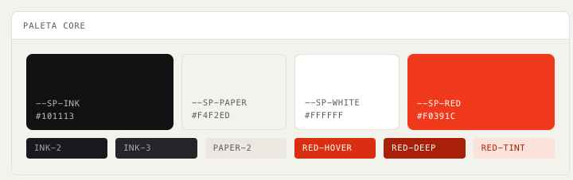

### Ink — ciemne powierzchnie i tekst główny
| Token | Hex | Rola |
|---|---|---|
| `--sp-ink` | `#101113` | Tło ciemne, tekst główny na jasnym |
| `--sp-ink-2` | `#18191C` | Karta na ciemnym |
| `--sp-ink-3` | `#232529` | Uniesiona powierzchnia / ciemne ramki |

### Paper — jasne powierzchnie
| Token | Hex | Rola |
|---|---|---|
| `--sp-paper` | `#F4F2ED` | Domyślne tło strony (ciepła biel) |
| `--sp-paper-2` | `#EBE8E1` | Wcięty pasek / nagłówek tabeli na jasnym |
| `--sp-white` | `#FFFFFF` | Karty na papierze |

### Signal red — jedyny akcent
| Token | Hex | Rola |
|---|---|---|
| `--sp-red` | `#F0391C` | Akcent, przycisk primary, focus |
| `--sp-red-hover` | `#D92E12` | Hover primary |
| `--sp-red-deep` | `#A82008` | Press / ciemnoczerwone panele |
| `--sp-red-tint` | `#FBE3DC` | Subtelna czerwona zalewka na jasnym |

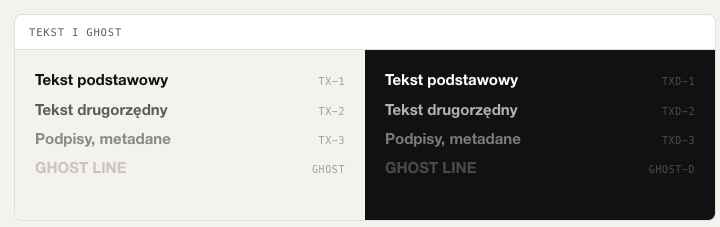

### Tekst na jasnym
| Token | Hex | Rola |
|---|---|---|
| `--sp-tx-1` | `#101113` | Tekst główny |
| `--sp-tx-2` | `#5C5B57` | Tekst drugorzędny |
| `--sp-tx-3` | `#8B8983` | Tekst wyciszony |
| `--sp-ghost` | `#C9C5BC` | Ghost lines w nagłówkach na papierze |

### Tekst na ciemnym
| Token | Wartość | Rola |
|---|---|---|
| `--sp-txd-1` | `#FFFFFF` | Tekst główny na ink |
| `--sp-txd-2` | `rgba(255,255,255,.68)` | Drugorzędny |
| `--sp-txd-3` | `rgba(255,255,255,.44)` | Wyciszony |
| `--sp-ghost-d` | `rgba(255,255,255,.24)` | Ghost lines na ink |

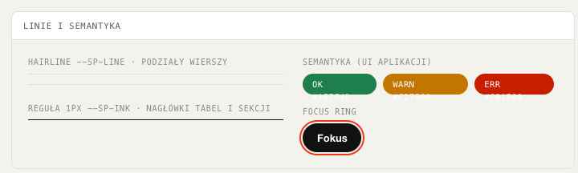

### Linie i hairline
| Token | Wartość | Rola |
|---|---|---|
| `--sp-line` | `#E2DFD7` | Hairline na papierze |
| `--sp-line-strong` | `#101113` | Reguła strukturalna 1px na jasnym |
| `--sp-line-d` | `rgba(255,255,255,.14)` | Hairline na ink |

### Semantyczne (UI aplikacji) i aliasy
| Token | Wartość | | Alias | → |
|---|---|---|---|---|
| `--sp-ok` | `#1E7F4D` | | `--surface-page` | `--sp-paper` |
| `--sp-warn` | `#C27500` | | `--surface-card` | `--sp-white` |
| `--sp-err` | `#C81E00` | | `--surface-inverse` | `--sp-ink` |
| | | | `--surface-accent` | `--sp-red` |
| | | | `--text-body` | `--sp-tx-1` |
| | | | `--text-muted` | `--sp-tx-2` |
| | | | `--accent` | `--sp-red` |
| | | | `--border-default` | `--sp-line` |

**Zasady koloru:** ❶ jeden akcent czerwieni na widok; ❷ karty na papierze są czyste białe, nie szare; ❸ struktura z linii, nie z cieni; ❹ bez gradientów; ❺ panel akcentowy = pełna zalewka `--sp-red` z białym tekstem, max jeden na widok.

---

## 2. Typografia

Źródło: `tokens/typography.css`, `tokens/fonts.css`.

| Rola | Font | Spec | Status |
|---|---|---|---|
| Display | **Archivo 800–900** | UPPERCASE, tracking −0.025em, leading 0.96 | ⚑ substytucja Google Fonts |
| Body | **Archivo 400/500** | sentence case, leading 1.55 | ⚑ jw. |
| Mono | **IBM Plex Mono 400–600** | mikro-etykiety, indeksy `/01`, daty, statystyki | domyślny |

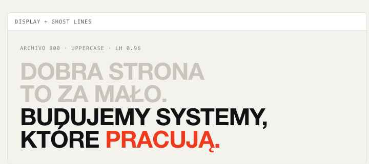

### Rodziny fontów
```
--font-display: "Archivo", "Helvetica Neue", Arial, sans-serif;
--font-body:    "Archivo", "Helvetica Neue", Arial, sans-serif;
--font-mono:    "IBM Plex Mono", "SFMono-Regular", Menlo, monospace;
```
Ładowanie: `@import` Archivo (100–900, ital) + IBM Plex Mono (400/500/600) z Google Fonts. Jeśli pojawią się fonty firmowe — wrzuć `.woff2` do `fonts/` i zamień `@import` na `@font-face`.

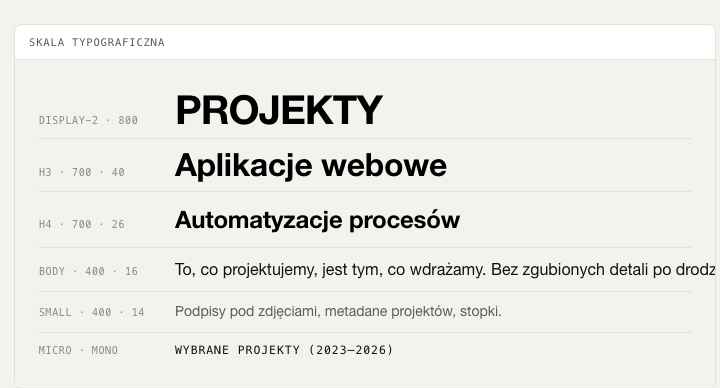

### Skala (desktop)
| Token | Wartość | Użycie |
|---|---|---|
| `--text-display-1` | `clamp(56px, 7.5vw, 112px)` | Hero, manifest |
| `--text-display-2` | `clamp(40px, 4.6vw, 68px)` | Nagłówek sekcji |
| `--text-h3` | `40px` | Podnagłówek |
| `--text-h4` | `26px` | — |
| `--text-h5` | `19px` | — |
| `--text-body` | `16px` | Tekst akapitowy |
| `--text-small` | `14px` | — |
| `--text-micro` | `11.5px` | Mono-etykiety (uppercase) |
| `--text-stat` | `clamp(64px, 8vw, 120px)` | Wielkie cyfry statystyk |

### Tracking i interlinia
| Token | Wartość | | Token | Wartość |
|---|---|---|---|---|
| `--ls-display` | `-0.025em` | | `--lh-display` | `0.96` |
| `--ls-tight` | `-0.01em` | | `--lh-heading` | `1.08` |
| `--ls-micro` | `0.08em` | | `--lh-body` | `1.55` |

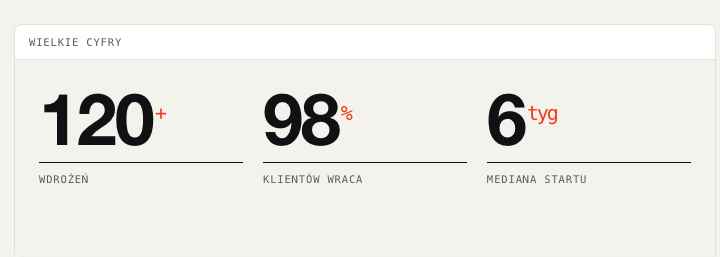

### Style semantyczne (gotowe w `typography.css`)
- `h1` / `.sp-display-1` → display-1, 800, UPPERCASE, tracking display, leading 0.96.
- `h2` / `.sp-display-2` → display-2, 800, UPPERCASE.
- `h3` → display 700, 40px, tracking tight, leading 1.08. `h4` → display 700, 26px. `h5` → display 600, 19px.
- `.sp-ghost` → kolor `--sp-ghost` (ghost line w nagłówku).
- `.sp-micro`, `code.label` → mono, 11.5px, 500, UPPERCASE, tracking 0.08em.
- `code, pre` → mono, 13.5px. `::selection` → tło `--sp-red`, tekst biały.

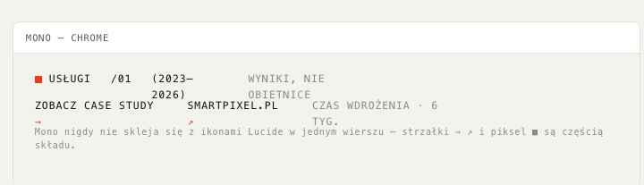

### Wzorce sygnaturowe
- **Ghost lines** — pierwsze takty nagłówka display renderujemy w `--sp-ghost` (na ink: `--sp-ghost-d`), puentę w ink; czerwienią można podbić **jedno** słowo lub takt.
- **Wielkie cyfry** — statystyki składane display 800 (64–120px) z jednostką (`%`, `+`) w mono na górnym indeksie.
- **Casing** — display: WERSALIKI; body i przyciski: sentence case; mono: WERSALIKI z literowaniem.

---

## 3. Spacing, promienie i layout

Źródło: `tokens/spacing.css`. Baza 4px.

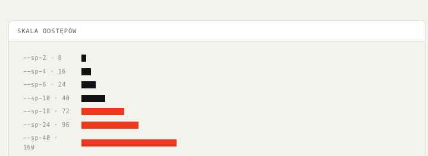

### Skala odstępów
| Token | Px | | Token | Px | | Token | Px |
|---|---|---|---|---|---|---|---|
| `--sp-1` | 4 | | `--sp-6` | 24 | | `--sp-18` | 72 |
| `--sp-2` | 8 | | `--sp-8` | 32 | | `--sp-24` | 96 |
| `--sp-3` | 12 | | `--sp-10` | 40 | | `--sp-32` | 128 |
| `--sp-4` | 16 | | `--sp-12` | 48 | | `--sp-40` | 160 |
| `--sp-5` | 20 | | `--sp-14` | 56 | | | |

Karty trzymają ciasny rytm (12–24); sekcje hero oddychają (72–160 między blokami).

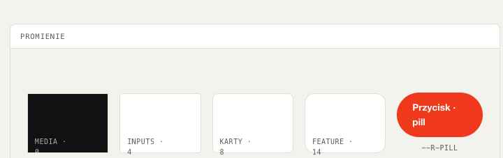

### Promienie
| Token | Px | Użycie |
|---|---|---|
| `--r-0` | 0 | Media na spad, panele strukturalne |
| `--r-sm` | 4 | Inputy, tagi na ciemnym |
| `--r-md` | 8 | Karty, miniatury |
| `--r-lg` | 14 | Duże karty feature, modale |
| `--r-pill` | 999 | Przyciski, chipy |

Domyślnie „dowolny przycisk" = pill; „dowolna karta" = 8px; media portfolio nigdy powyżej 8px.

### Layout
| Token | Wartość |
|---|---|
| `--container` | `1320px` |
| `--gutter` | `clamp(20px, 4vw, 56px)` |
| `--section-gap` | `clamp(72px, 10vw, 160px)` |
| `--header-h` | `72px` |

Mobile-first (dobrze od 390px). Sticky header 72px: papier z `backdrop-filter: blur(16px)` przy przewinięciu, hairline od dołu. Nagłówek sekcji = **Eyebrow** (czerwony kwadrat-piksel + mono-etykieta) po lewej, opcjonalna notka mono po prawej, potem display z ghost lines.

---

## 4. Efekty — elewacja, ruch, stany

Źródło: `tokens/effects.css`. Marka jest płaska i „drukarska": struktura z hairline'ów, cienie rzadkie i miękkie.

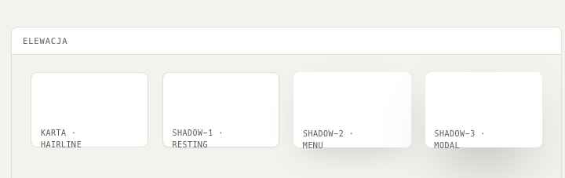

### Cienie (tylko funkcjonalne)
| Token | Wartość | Użycie |
|---|---|---|
| `--shadow-1` | `0 1px 2px rgba(16,17,19,.06)` | Spoczynkowa karta (opcjonalnie) |
| `--shadow-2` | `0 16px 40px -16px rgba(16,17,19,.22)` | Menu, sticky bary |
| `--shadow-3` | `0 32px 72px -24px rgba(16,17,19,.38)` | Modale |

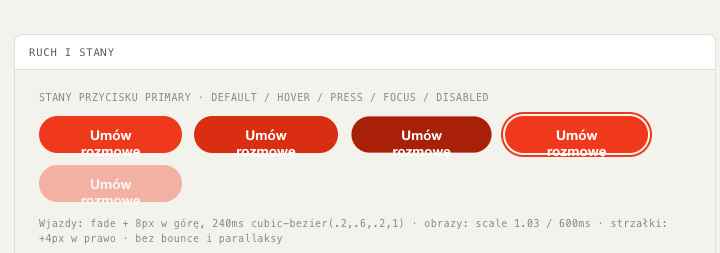

### Ruch
| Token | Wartość | Użycie |
|---|---|---|
| `--ease-out` | `cubic-bezier(0.2, 0.6, 0.2, 1)` | Wjazdy, hover |
| `--ease-soft` | `cubic-bezier(0.33, 1, 0.5, 1)` | Miękkie przejścia |
| `--dur-fast` | `140ms` | Hover |
| `--dur-base` | `240ms` | Reveal, akordeony |
| `--dur-slow` | `600ms` | Skalowanie obrazów, przejścia stron |

Wjazdy: fade + 8px w górę. Obrazy w kartach projektu skalują się do 1.03 w 600ms. Strzałki linków przesuwają się o 4px w prawo. Bez bounce'ów, parallaksu i animowanych gradientów. `prefers-reduced-motion` wyłącza animacje (transition 1ms).

### Focus i stany
- `--focus-ring`: `0 0 0 2px var(--sp-paper), 0 0 0 4px var(--sp-red)` — 2px odsadka papieru + 2px ring czerwieni.

| Stan | Zachowanie |
|---|---|
| Hover (przycisk) | primary → `--sp-red-hover`; dark → rozjaśnienie do `--sp-ink-3`; outline → zalewka ink + biały tekst |
| Hover (link/karta) | podkreślenie 1px ink / strzałka +4px / obraz scale 1.03 |
| Press | scale 0.98, 80ms |
| Focus | ring `--focus-ring` |
| Disabled | 35% opacity, bez kursora pointer |

---

## 5. Komponenty

Reużywalne komponenty React w `components/` (każdy z `.jsx`, `.d.ts`, `.prompt.md`). Złożenia: `ui_kits/website/`.

### core/
| Komponent | Opis | Kluczowe propsy |
|---|---|---|
| **Button** | Pill, jeden akcent na widok | `variant` (`primary` \| `dark` \| `outline` \| `ghost` \| `inverse`), `size` (`sm`/`md`/`lg`), `arrow`, `as` (`button`/`a`), `href`, `disabled` |
| **ArrowLink** | Mono-link ze strzałką `→`/`↗`, czerwona, przesuw na hover | `external` (↗), `dark`, `href`, `onClick` |
| **Eyebrow** | Otwarcie sekcji: czerwony piksel ■ + mono etykieta | `note` (np. „(2023—2026)"), `dark` |
| **Stat** | Wielka cyfra display 800 + jednostka mono w indeksie + etykieta nad regułą 1px | `value`, `unit` (`%`/`+`/`tyg`), `label`, `desc`, `size`, `dark` |
| **Tag** | Chip pill (mono uppercase) — kategorie, filtry, meta | `active` (zalewka ink), `dark`, `onClick` |

### forms/
| Komponent | Opis | Kluczowe propsy |
|---|---|---|
| **Input** | Mono etykieta, biały field, hairline, focus = czerwona ramka + ring | `label`, `placeholder`, `type`, `value`, `error`, `required`, `dark` |
| **Textarea** | Wieloliniowe pole, spójne z Input | `label`, `rows`, `value`, `required`, `dark` |
| **Select** | Natywny select w skórze systemu, czerwona strzałka | `options` (`string[]` lub `{value,label}[]`), `value`, `placeholder`, `dark` |

### content/
| Komponent | Opis | Kluczowe propsy |
|---|---|---|
| **ProjectCard** | Karta portfolio: ostre media, hover = scale 1.03 + czerwony krążek ↗ | `image`, `title`, `client`, `tags` (max 2), `year`, `href`, `ratio` (np. „4 / 3") |
| **ServiceRow** | Wiersz-akordeon usługi: `/index` + tytuł display (ghost → ink po otwarciu) + zakres | `index` („01"), `title`, `lead`, `items`, `timeframe`, `open`, `onToggle`, `dark` |
| **QuoteCard** | Cytat klienta: piksel ■, display 600, podpis mono nad hairline | `quote` (bez cudzysłowów — dodawane auto), `name`, `role`, `accent` (zalewka czerwieni), `dark` |

### navigation/
| Komponent | Opis | Kluczowe propsy |
|---|---|---|
| **Header** | Sticky 72px: papier z blur(16px), hairline od dołu, logo + mono nav + outline CTA. Eksportuje też `SPLogo` | `links` (`{label,href}[]`), `active`, `onNavigate`, `ctaLabel`, `onCta`, `sticky` |
| **Footer** | Na ink: kolumny linków, e-mail z czerwonym podkreśleniem, gigantyczny wordmark SMARTPIXEL, mono bottom bar | `columns`, `note`, `email`, `city`, `year`, `onNavigate` |

### Logo (`assets/`)

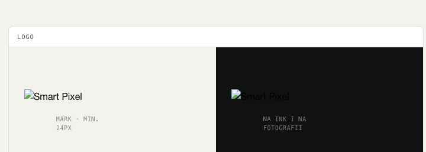

- `logo-smartpixel-mark.svg` / `-mark-white.svg` — znak (klaster pikseli), na jasne / ciemne tło.
- `logo-smartpixel-lockup.svg` / `-lockup-white.svg` — lockup (znak + wordmark).

⚑ Logo zaprojektowane od zera jako propozycja — wymaga akceptacji.

---

## 6. Powierzchnie i sekcje

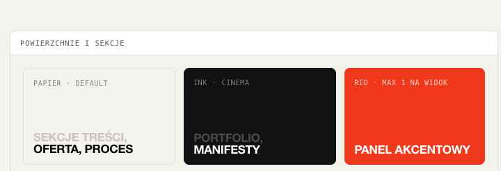

- **Strona:** płaski `--sp-paper`. Bez tekstur, bez szumu, bez gradientów.
- **Sekcje cinema:** pełny `--sp-ink`, fotografia może wychodzić na spad (radius 0).
- **Panel akcentowy:** pełna zalewka `--sp-red` z białym tekstem — max jeden na widok.
- **Karty:** białe na papierze, `--sp-ink-2` na ink; hairline zamiast cienia.

**Fotografia.** Edytorialna, kontrastowa, z jednym mocnym akcentem koloru albo czarno-biała architektura/produkt. Ciepły, lekko przygaszony grading. Bez stockowych uścisków dłoni, bez generowanych twarzy. Zdjęcia kadrowane ostro (radius 0–8px), podpisy w mono.

---

## 7. Głos i ton

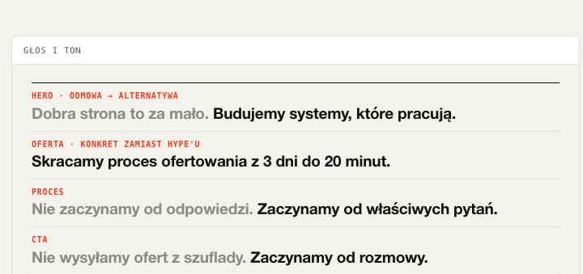

- **Po polsku**, z poprawnymi diakrytykami. Angielski tylko dla terminów branżowych bez naturalnego tłumaczenia (`web app`, `case study`, `API`, `no-code`).
- **„My" mówi studio, „Ty" to klient.** Pierwsza osoba mnoga dla zespołu (*„Projektujemy. Wdrażamy."*), bezpośrednie „Ty/Twój" dla odbiorcy. Nigdy bezosobowo („oferujemy państwu").
- **Kadencja manifestu: odmowa → alternatywa.** Nagłówki krótkie, dwutaktowe: *„Nie wysyłamy ofert z szuflady. Zaczynamy od rozmowy."*
- **Konkret zamiast hype'u.** Mierzalne efekty: *„Skracamy proces ofertowania z 3 dni do 20 minut."*
- **Casing.** Display: WERSALIKI. Body i przyciski: sentence case. Mono-etykiety: WERSALIKI z literowaniem.
- **Długość.** Nagłówek ≤ 8 słów na takt. Akapit body 2–3 zdania. Etykieta mono 1–4 słowa.
- **Bez emoji.** Marka jest redakcyjna i druk-podobna — emoji nie występują ani w treści, ani w UI.

### Przykłady głosu (wzorce do reużycia)
- *„Dobra strona to za mało. / Budujemy systemy, które pracują."* (hero)
- *„Bierzemy mniej projektów. Każdy dostaje pełną uwagę."*
- *„To, co projektujemy, jest tym, co wdrażamy. Bez zgubionych detali po drodze."*
- *„Nie zaczynamy od odpowiedzi. Zaczynamy od właściwych pytań."*
- Mono-etykiety: `USŁUGI`, `PROJEKTY`, `PROCES`, `/01`, `(2023—2026)`, `WYNIKI, NIE OBIETNICE`

### Czego unikać
- Korporacyjnych wytrychów: „kompleksowy", „innowacyjny", „dedykowany", „synergia".
- Wykrzykników i SCREAMING CAPS poza systemowym uppercase'em display.
- Tonu proszącego — marka proponuje rozmowę, nie błaga o kontakt.
- Emoji, ozdobnych ikon w treści, clipartów.

---

## 8. Ikonografia

**Brak ikon pierwszej ręki** — większość „ikonografii" to **typografia**: indeksy `/01`, strzałki `→ ↗`, nawiasy `(2023—2026)`, czerwony kwadrat ■ jako brandowy bullet.

- Substytucja dla chrome UI: **Lucide** (CDN, stroke 1.75, zaokrąglone końcówki) — strzałki nawigacji, zamknięcie, menu, pola formularzy.
  ```html
  <script src="https://unpkg.com/lucide@latest/dist/umd/lucide.js"></script>
  ```
- Strzałki w linkach/przyciskach: znaki tekstowe `→` i `↗` w foncie display — celowy, drukarski wybór (nie zamieniać na SVG).
- **Zero emoji.** Unicode poza `→ ↗ ■ ( ) /` nie służy jako ikony.

---

## Jak używać systemu

1. Podepnij `styles.css` — dostaniesz wszystkie tokeny, fonty i style semantyczne.
2. Domyślnie projektuj na **papierze**; **ink** dla sekcji cinema; **czerwień raz na widok**.
3. Każdą sekcję otwieraj **Eyebrow + display z ghost lines**.
4. Struktura z **linii**, nie z cieni. Bez gradientów, bez emoji.
5. Komponenty bierz z `components/`, wzorce złożeń z `ui_kits/website/`.

## Zastrzeżenia (⚑)

- **Fonty to substytucje** (Archivo + IBM Plex Mono z Google Fonts) — podmień w `tokens/fonts.css`, jeśli istnieją fonty firmowe.
- **Logo zaprojektowane od zera** (klaster pikseli) jako propozycja — wymaga akceptacji.
- Treści przykładowe (liczby, nazwy klientów, ceny) są **fikcyjne**.
- Brak materiałów źródłowych firmy — całość to ekstrapolacja briefu + referencji wizualnej (szablon Spector).
